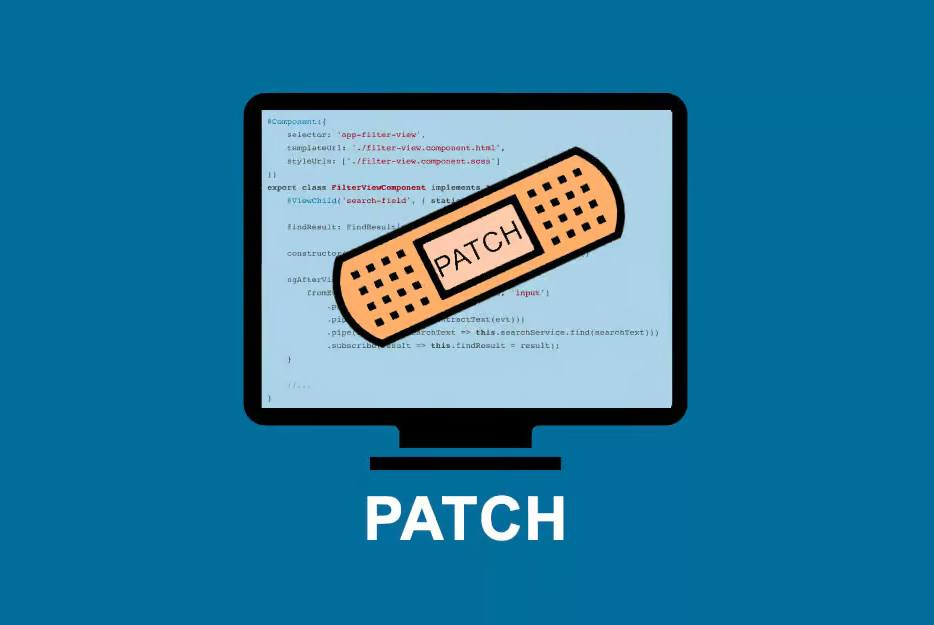

# 🛡️ LAB 04 - Parcheo de Sistemas (Remediación y Hardening)
### Competencia: Analista SOC Nivel 1 | Licencia Defensa Activa

> Una vez identificada una debilidad mediante escaneos o logs, el equipo de defensa debe ejecutar protocolos de mitigación o remediación directa para cerrar el vector de ataque antes de que sea explotado.



---

## 🎯 Objetivos de Aprendizaje

Al finalizar este laboratorio, serás capaz de:
1.  Aplicar parches de seguridad en entornos Linux (Ubuntu/Debian)
2.  Gestionar Windows Update mediante PowerShell
3.  Aplicar hardening como medida de compensación cuando no se puede parchear
4.  Documentar la remediación según procedimiento SOC L1

## 📖 Escenario SOC

Eres Analista SOC L1 en turno de noche. El SIEM ha generado 3 alertas críticas:

**ALERTA 1 [CRÍTICA]:** `srv-ubuntu-01` - OpenSSH 8.2p1 vulnerable a CVE-2024-6387 (RegreSSHion). Requiere actualización inmediata.
**ALERTA 2 [CRÍTICA]:** `wks-finanzas-07` - Protocolo SMBv1 detectado. Vector EternalBlue. No hay parche disponible sin ventana de mantenimiento.
**ALERTA 3 [MEDIA]:** `srv-ubuntu-01` - Puerto 21/FTP (vsftpd) expuesto a internet sin necesidad de negocio.

Tu misión: Remediar y mitigar.

---

## 🛠 1. Comandos de Remediación Directa (Parcheo de Software)

### A. Gestión de Parches en Entornos Linux (Ubuntu/Debian)

```bash
# 1. Actualizar el índice de paquetes disponibles
sudo apt update

# 2. Simular la actualización para comprobar dependencias antes de aplicar cambios
sudo apt --simulate upgrade

# 3. Actualizar únicamente el servicio vulnerable detectado (ej. OpenSSH)
sudo apt --only-upgrade install openssh-server

# 4. Verificar versión parcheada
ssh -V
```

> **Buena práctica SOC:** Nunca hagas `apt upgrade -y` directo en producción sin simular.

### B. Gestión de Parches en Entornos Windows (PowerShell)

```powershell
# Instalar el módulo de gestión de Windows Update (si no está presente)
Install-Module PSWindowsUpdate -Force

# Buscar actualizaciones de seguridad críticas disponibles
Get-WindowsUpdate -Category "Security Updates" -Severity Critical

# Listar solo lo que falta
Get-WUList

# Instalar todos los parches de seguridad pendientes reiniciando si es necesario
Install-WindowsUpdate -MicrosoftUpdate -AcceptAll -AutoReboot
```

---

## 🚧 2. Mitigación mediante Configuración Segura (Hardening)

Cuando no puedes parchear inmediatamente (ventana de cambio, app legacy), aplicas controles de compensación.

### Desactivar SMBv1 (Protocolo crítico afectado por EternalBlue)

* **En Windows (PowerShell Admin):**
```powershell
# Verificar estado
Get-WindowsOptionalFeature -Online -FeatureName SMB1Protocol

# Desactivar
Disable-WindowsOptionalFeature -Online -FeatureName SMB1Protocol -NoRestart

# Verificar que el puerto 445 no expone SMBv1
Get-SmbServerConfiguration | Select EnableSMB1Protocol
```

* **En Linux (Auditoría y cierre de puertos):**
```bash
# Auditar puertos abiertos
ss -tuln
sudo netstat -tulpn | grep LISTEN

# Si detectas un puerto innecesario abierto (ej. FTP en 21), ciérralo de inmediato:
sudo systemctl stop vsftpd
sudo systemctl disable vsftpd
sudo systemctl status vsftpd

# Bloqueo adicional con UFW
sudo ufw deny 21/tcp
sudo ufw status verbose
```

---

## ✅ Tareas del Laboratorio

Completa los siguientes pasos y documenta con capturas en `/tareas/evidencias.md`

- [ ] **Tarea 1:** En tu VM Ubuntu, ejecuta `apt update` y `apt --simulate upgrade` y guarda el output.
- [ ] **Tarea 2:** Parchea solo `openssh-server` y verifica la nueva versión con `ssh -V`.
- [ ] **Tarea 3:** En Windows, ejecuta `Get-WindowsUpdate` y lista los parches críticos pendientes.
- [ ] **Tarea 4:** Deshabilita SMBv1 y verifica que `EnableSMB1Protocol` es False.
- [ ] **Tarea 5:** Audita con `ss -tuln`, identifica vsftpd en puerto 21 y deshabilita el servicio.

## 📤 Entregable

1.  Archivo `evidencias.md` con comandos y outputs.
2.  Captura de tu terminal mostrando el parcheo.
3.  (Opcional) Log de hardening.

## 🔍 Validación Automática

Este repo incluye un workflow que valida que has completado las evidencias.

## 📚 Referencias SOC

- MITRE ATT&CK: M1051 - Update Software
- CIS Benchmarks: Disable SMBv1
- NIST SP 800-40: Guide to Enterprise Patch Management## Uso empresarial
---
   ## Resumen del laboratorio
   Laboratorio de parcheo y hardening para SOC L1/L2. Validación de ciclo de vida de parches en Ubuntu y Windows, deshabilitado de SMBv1 y cierre de puertos (vsftpd/21) con UFW.
   Autor: Iván Ajenjo Morales | L1/L2 ITIL SecOps | Licencia MIT
